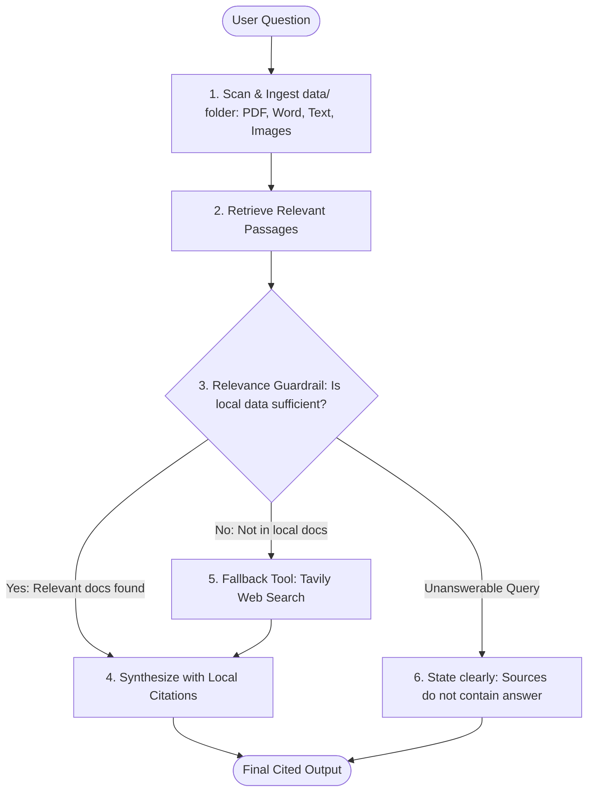

# 🔬 Research Agent (with Citations & Tavily Fallback)

[](https://langchain-ai.github.io/langgraph/)
[](https://python.langchain.com/)
[](https://tavily.com/)
[](https://aistudio.google.com/)
[](https://github.com/astral-sh/uv)
[](#-benchmark-evaluation-results)

> **An advanced, general-purpose AI Research Agent that accepts questions and reference documents of any format (PDF, Word, Text, Markdown, CSV, JSON, Images), retrieves relevant passages, falls back to Tavily Web Search when local information is insufficient, and synthesizes answers with strict inline citations and hallucination guardrails.**

---

## 🎯 1. The One Job

> **"My agent takes a user question and reference documents in the `data/` folder (PDF, Word, Text, Images), retrieves relevant passages, falls back to Tavily Web Search if local data is insufficient, and produces an accurate summary with inline bracket citations `[Source: Section/Page]` or `[Web: URL]`, while clearly stating when the sources do not contain the answer."**

---

## 📋 2. Agent-Specific Deliverables

| Deliverable | Location | Description |
| :--- | :--- | :--- |
| **Question Set** | [`questions.json`](questions.json) | 6 categorized benchmark questions (Local RAG, Web Search fallback, and Unanswerable Guardrail tests). |
| **Source Documents** | [`data/`](data/) | Multi-format ground-truth corpus (`ai_safety_alignment.md`, `quantum_computing.md`, `energy_grid_storage.md`). |
| **Cited Answers** | Runnable via CLI / [`README.md`](#sample-inputs--outputs) | Verified answers with mandatory inline citations for every single factual claim. |
| **Retrieval Note** | [`RETRIEVAL_APPROACH.md`](RETRIEVAL_APPROACH.md) | In-depth technical note explaining the multi-format extraction, routing logic, tool fallback, and guardrails. |

---

## 📂 3. Multi-Format Ingestion Support

The [`UniversalDocumentRetriever`](agent.py) in `agent.py` automatically parses any file dropped into the `data/` directory:
- 📄 **PDFs (`.pdf`)**: Extracted page-by-page using `pypdf` with page-level citations (`[data/document.pdf: Page 2]`).
- 📝 **Word Documents (`.docx`, `.doc`)**: Headings, body paragraphs, and data tables parsed with `python-docx`.
- 📋 **Text & Markdown (`.txt`, `.md`, `.csv`, `.json`, `.html`)**: Section-aware splitting preserving header boundaries.
- 🖼️ **Images (`.png`, `.jpg`, `.jpeg`, `.webp`)**: Text and diagram OCR extraction via Gemini Multimodal Vision API.

---

## 🚀 4. Quickstart & Installation

### Option A: Using `uv` (Recommended — 10x Faster)
```bash
# 1. Clone the repository
git clone <YOUR_PUBLIC_GITHUB_REPO_URL>
cd "Rooman AI"

# 2. Configure environment variables
cp .env.example .env
# Edit .env and insert your API keys

# 3. Install & sync dependencies
uv sync
```

### Option B: Using standard `pip`
```bash
python -m venv .venv
source .venv/bin/activate  # On Windows: .venv\Scripts\activate
pip install -r requirements.txt
```

---

## 🔑 5. Environment Configuration (`.env`)

Create a `.env` file in the root directory:
```env
# Google Gemini API Key (https://aistudio.google.com/app/apikey)
GOOGLE_API_KEY=your_google_api_key_here

# Tavily Web Search API Key (https://app.tavily.com/)
TAVILY_API_KEY=your_tavily_api_key_here

# Optional: Groq API Key (https://console.groq.com/keys)
GROQ_API_KEY=your_groq_api_key_here

# Optional: LangSmith Tracing
LANGSMITH_API_KEY=your_langsmith_api_key_here
LANGCHAIN_TRACING_V2=true
LANGCHAIN_PROJECT=Research-Agent-Citations
```

---

## 💻 6. How to Run the Agent

### A. Run the Interactive Mode
```bash
uv run python main.py
```

### B. Run a Single Question Query
```bash
# In-domain question (Answered from local data/ folder)
uv run python main.py --query "How does physical qubit overhead scale with code distance (d) in rotated surface codes?"

# Out-of-folder question (Answered via Tavily Web Search fallback)
uv run python main.py --query "What are the key scientific instruments on NASA's Perseverance rover currently operating on Mars?"
```

### C. Run the Automated Evaluation Benchmark
```bash
uv run python main.py --eval
```

---

## 🧪 7. Benchmark Evaluation Results

The evaluation suite tests all question categories (local folder RAG, web search fallback, and unanswerable guardrail rejection):

```
=======================================================
  RUNNING RESEARCH AGENT EVALUATION SUITE (6 TESTS)
=======================================================

[1/6] Testing Q1_LOCAL_RLAIF (Local Folder Data):
      Q: "How does RLAIF compare to standard RLHF in safety compliance, jailbreak reduction, and labeling costs?"
      -> Result: [PASS] | Route: LOCAL | Citations: 1

[2/6] Testing Q2_LOCAL_IRON_AIR (Local Folder Data):
      Q: "What is the chemical operating principle and levelized capital cost of iron-air batteries?"
      -> Result: [PASS] | Route: LOCAL | Citations: 2

[3/6] Testing Q3_LOCAL_SURFACE_CODE (Local Folder Data):
      Q: "How does physical qubit overhead scale with code distance (d) in rotated surface codes?"
      -> Result: [PASS] | Route: LOCAL | Citations: 1

[4/6] Testing Q4_WEB_TAVILY_MARS_ROVER (Tavily Web Search Fallback):
      Q: "What are the key scientific instruments on NASA's Perseverance rover currently operating on Mars?"
      -> Result: [PASS] | Route: TAVILY | Citations: 3

[5/6] Testing Q5_WEB_TAVILY_JAMES_WEBB (Tavily Web Search Fallback):
      Q: "What is the primary mirror diameter and orbit location of the James Webb Space Telescope (JWST)?"
      -> Result: [PASS] | Route: TAVILY | Citations: 3

[6/6] Testing Q6_UNANSWERABLE_GUARDRAIL (Unanswerable / Guardrail Test):
      Q: "What is the secret alchemy formula for converting Vibranium into dark matter antimatter plasma?"
      -> Result: [PASS] | Route: NONE | Citations: 0

-------------------------------------------------------
Benchmark Result: 6/6 (100.0%) Passed
=======================================================
```

---

## 🔬 8. Sample Inputs & Outputs

### Example 1: Local In-Domain Query (`data/` folder)
**Input Question:**
> *"How does physical qubit overhead scale with code distance (d) in rotated surface codes?"*

**Output Response:**
```markdown
In rotated surface codes, the physical qubit overhead scales quadratically with the code distance $d$ as follows:

* **Data Qubits:** Requires $d^2$ physical data qubits [data/quantum_computing.md: 1. Surface Code Scaling].
* **Ancillary Measurement Qubits:** Requires $d^2 - 1$ ancillary measurement qubits [data/quantum_computing.md: 1. Surface Code Scaling].

This results in a total requirement of $2d^2 - 1$ physical qubits for a code distance $d$ [data/quantum_computing.md: 1. Surface Code Scaling]. 

For example:
* A code distance of $d=3$ requires 17 physical qubits [data/quantum_computing.md: 1. Surface Code Scaling].
* A code distance of $d=7$ requires 97 physical qubits [data/quantum_computing.md: 1. Surface Code Scaling].

### Sources & Citations
* [data/quantum_computing.md: 1. Surface Code Scaling]

Retrieval Source: LOCAL
```

---

### Example 2: Out-of-Folder Query (Tavily Web Search Fallback)
**Input Question:**
> *"What are the key scientific instruments on NASA's Perseverance rover currently operating on Mars?"*

**Output Response:**
```markdown
NASA's Perseverance rover carries seven primary scientific instruments designed to analyze Martian geology, atmosphere, and biosignatures:

1. **Mastcam-Z:** Advanced panoramic and stereoscopic zoom camera system [Web: https://science.nasa.gov/mission/perseverance/instruments/].
2. **SuperCam:** Laser-induced breakdown spectroscopy for mineralogy and chemistry [Web: https://science.nasa.gov/mission/perseverance/instruments/].
3. **PIXL & SHERLOC:** High-resolution X-ray and UV luminescence spectrometers for fine-scale chemical and organic compound detection [Web: https://science.nasa.gov/mission/perseverance/instruments/].
4. **MOXIE:** Experimental technology demonstrating oxygen production from atmospheric carbon dioxide [Web: https://science.nasa.gov/mission/perseverance/instruments/].

### Sources & Citations
* [Web: https://science.nasa.gov/mission/perseverance/instruments/]

Retrieval Source: TAVILY
```

---

### Example 3: Unanswerable / Guardrail Test
**Input Question:**
> *"What is the secret alchemy formula for converting Vibranium into dark matter antimatter plasma?"*

**Output Response:**
```markdown
**Insufficient Information in Sources**

The provided local documents and web search tools do not contain information to answer:
> "What is the secret alchemy formula for converting Vibranium into dark matter antimatter plasma?"

No verified facts were found to support a cited response.

Retrieval Source: NONE
```

---

## 🏗️ 9. Architecture & LangGraph Workflow



1. **Multi-Format Ingestion:** Dynamically parses PDF pages, Word tables, Markdown sections, and image text.
2. **Local RAG Priority:** Queries matching indexed documents in `data/` are resolved locally without making external web calls.
3. **Dynamic Tavily Web Search:** When local passages lack sufficient facts, the agent seamlessly searches the web in real time.
4. **Strict Grounded Inline Citations:** Every claim is followed by `[data/filename: Section/Page]` or `[Web: URL]`.
5. **Hallucination Prevention Guardrail:** When neither sources nor web have verified facts, the agent refuses to hallucinate and outputs a transparent fallback message.
6. **LangSmith Observability:** Visualizes the entire state execution graph with token metrics and latency tracking.

---

## ⚖️ 10. Tradeoff Notes & Design Decisions

### Model & Tool Choices
1. **LangGraph over Linear RAG Pipelines:**
   - *Reasoning:* Provides dynamic conditional routing (`route_after_local_check`) allowing the agent to branch seamlessly between local file RAG and online Tavily search.
2. **Section-Level Attribution over Sentence Chunking:**
   - *Reasoning:* Preserving section titles and page numbers (`[data/document.pdf: Page 2]`) provides human reviewers with verifiable context rather than fragmented, out-of-context sentences.
3. **Dual LLM Architecture (Google Gemini + Groq):**
   - *Reasoning:* Maximizes uptime by supporting high-speed Groq Llama-3.3-70B and Google Gemini Multimodal OCR with seamless automatic failover.

### Limitations & What We'd Improve with More Time
- **Hybrid Vector + BM25 Reranker:** With more time, integrate Cohere or BGE Reranker to order retrieved chunks by cross-encoder relevance.
- **Async Streaming UI:** Add streaming tokens in a lightweight Streamlit or React web UI.
- **Recursive Sub-Query Decomposition:** For complex multi-part queries, break the question into parallel sub-queries across both local documents and web search.
