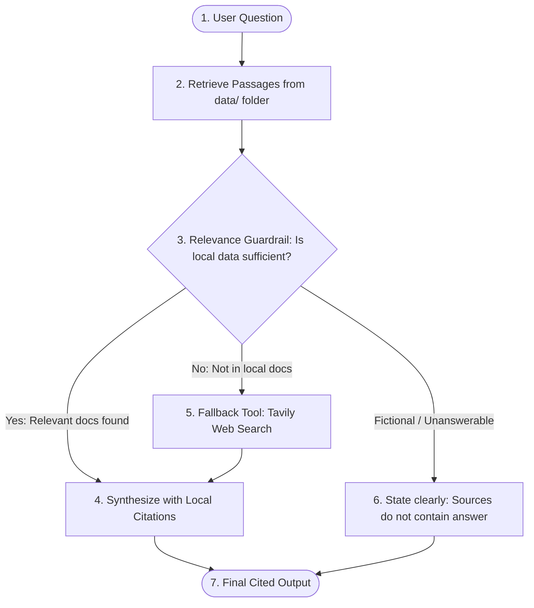

# Technical Note: Retrieval, Tavily Search & Citation Approach

## 1. Overview
The **Research Agent (with Citations)** is built using **LangGraph**, providing structured multi-step execution, dynamic routing, and observability via LangSmith.

It addresses two primary operational modes:
1. **Local Retrieval-Augmented Generation (RAG):** When questions pertain to reference documents stored in the `data/` folder.
2. **Online Tavily Web Search Tool Fallback:** When the local `data/` folder lacks relevant passages, the agent dynamically invokes Tavily API to retrieve ground-truth web content.

---

## 2. Architecture & LangGraph Workflow

---

## 3. Core Components

### A. Local Ingestion & Section-Aware Chunking ([`data/`](data/))
- The [`LocalDocumentRetriever`](agent.py) scans the `data/` directory for `.md` and `.txt` files.
- Documents are split into section-tagged blocks using markdown heading boundaries (`##`).
- Metadata retains `file`, `section`, and formatted attribution tags (`[data/filename.md: Section]`).

### B. Relevance Guardrail & Routing
- Before generating an answer, the agent checks if query terms exist in the local passage index.
- If relevant local passages are found, execution routes directly to answer synthesis.
- If no matching passages exist in `data/`, the workflow automatically routes to the `tavily_search` node.

### C. Tavily Web Search Fallback
- The agent calls `TavilyClient.search(query=...)` to retrieve the top 3 verified online sources.
- Web search results are tagged with clean domain URLs: `[Web: https://...]`.

### D. Citation Attribution & Formatting
- Strict system instructions enforce inline bracket citations following every claim:
  - Local claims: `[data/quantum_computing.md: 1. Surface Code Scaling]`
  - Web claims: `[Web: https://science.nasa.gov/mission/perseverance/instruments/]`
- A consolidated `### Sources & Citations` reference list is appended to the output.

### E. Missing Information & Hallucination Guardrail
- If neither the local `data/` folder nor the search tool contains verified facts (e.g. fictional, impossible, or out-of-scope queries), the agent is prohibited from guessing.
- It outputs:
  > *"The provided local documents and web search tools do not contain information to answer: [topic]."*

---

## 4. LangSmith Tracing
The application automatically logs all LangGraph graph transitions, node inputs, tool calls, and LLM completions to LangSmith when `LANGSMITH_API_KEY` is present in `.env`.
